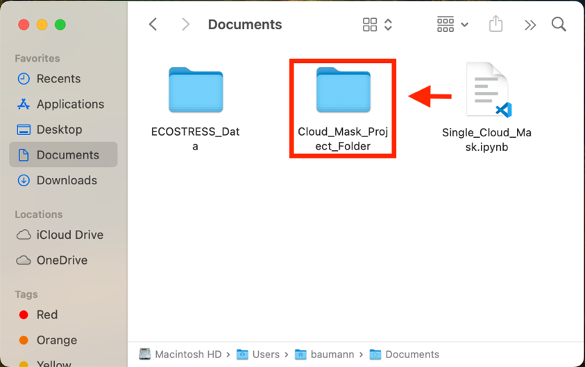
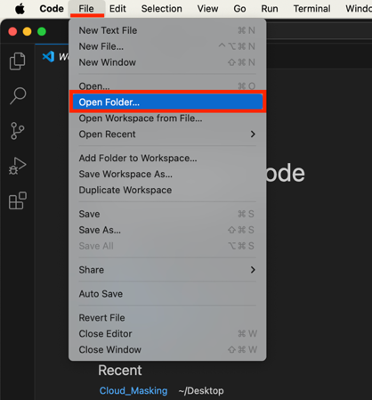
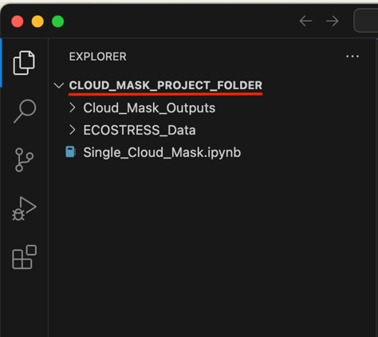
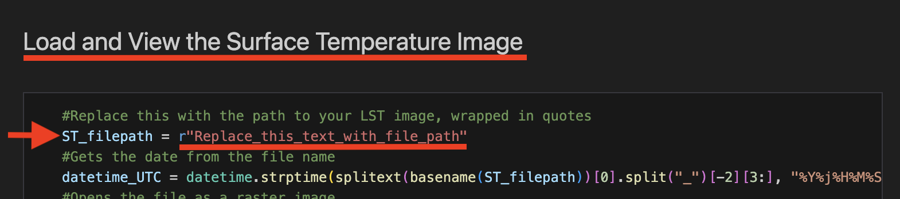
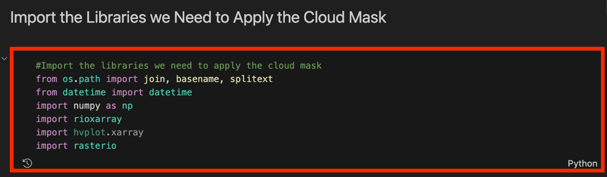
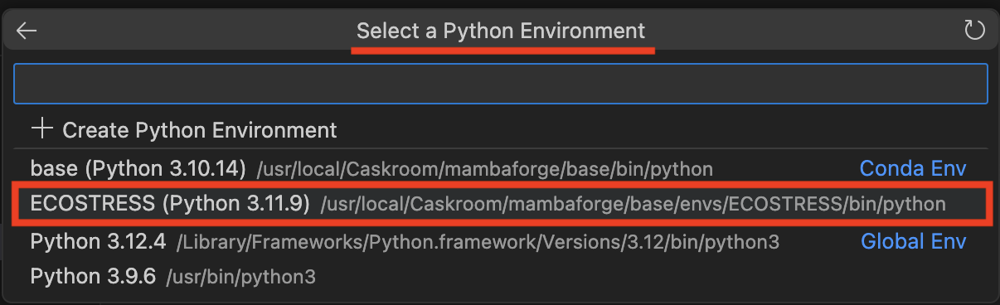
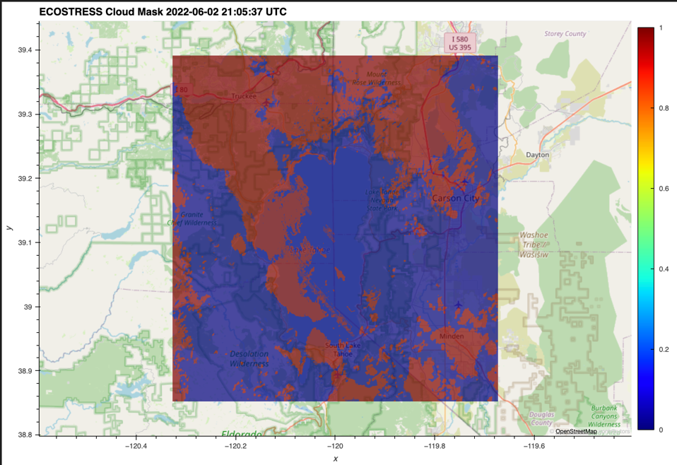

> *This tutorial will show you how to use code to apply a cloud mask to
> a single ECOSTRESS image. This code applies a cloud mask to a Land
> Surface Temperature (LST) image, but it can be modified for other
> ECOSTRESS products.*

# Table of Contents

[What is a Cloud Mask?](#what-is-a-cloud-mask)

[Applying a Cloud Mask to a Single Image](#applying-a-cloud-mask-to-a-single-image)

# What is a Cloud Mask?

A cloud mask is an image used to help determine if there is cloud
presence in remotely sensed imagery. The mask is binary, meaning it
either indicates the presence of a cloud or it does not. If it does
indicate the presence of a cloud, that pixel can be removed from the
remotely sensed image to improve the accuracy of the overall image.

**Tip**: Make sure you have **Cloud Mask files** downloaded in addition
to your ECOSTRESS product files. If you do not know how to download
these files, see the **Downloading from AppEEARS** tutorial.

## Applying a Cloud Mask to a Single Image

1.  Download the **Single_Cloud_Mask** code from
    <https://github.com/ECOSTRESS-Tutorials/ECOSTRESS-Single-Cloud-Mask>.

2.  Open your **finder**. Create a **project folder** to store all the
    files for this project by **right clicking** and selecting **New
    Folder**. Name your new folder so that you know it is the main
    project folder.

3.  **Move** the **downloaded code** file into the project folder.

4.  **Move** the folder with your **downloaded ECOSTRESS data** into the
    project folder.

5.  In the project folder, create a new **sub folder** to store the
    completed cloud masked file. To do this, go inside the project
    folder, **right click**, and select **New Folder**. Then name the
    folder so that you know it is for the **outputs**.

6.  Next, open **Visual Studio Code** and use **File \> Open Folder…**
    to get connected to the main project folder that contains the
    downloaded ECOSTRESS files, the Single_Cloud_Mask code, and the
    output subfolder.

|  |  |
|----|----|

1.  In the **EXPLORER** tab, find the **Single_Cloud_Mask** code and
    click on it to open it.

**Tip**: If you want to know more about what each line of the code does,
read the **comments** in the code. Comments in the code are identified
by **\#**. These comments do not actually change how the code runs, but
they can be helpful to put notes on how the code works for yourself or
other users. This can also be helpful if you want to customize the code
because it will guide you to which parts you may want to change!

**Examples** of comments (**green text following the \#):**

2.  Find the section of the code titled **Load and View the Surface
    Temperature Image**. Find the variable called **ST_filepath**.
    Change the text that says **"Replace_this_text_with_file_path"** to
    the path to the ECOSTRESS LST image that you want to cloud mask.

1.  To **copy the file path**, use the **EXPLORER** panel on the left
    side of Visual Studio Code to find the file you are interested in.
    Once you have found it, **right click** on it and select **Copy
    Path**. Now you can paste the path into your code. Make sure it is
    still **wrapped in quotes** and has **r** outside the first quote.

**Example:**

3.  Now, find the section of the code titled **Load and View the Cloud
    Mask**. Find the variable called **cloud_filepath**. Change the text
    that says **"Replace_this_text_with_file_path"** to the whole file
    path of the corresponding **Cloud Mask** image for your LST image.
    To make sure it is the corresponding Cloud Mask image, make sure
    that the **date codes** of both the LST and Cloud Mask images
    **match**. The date code is the string of numbers listed after
    **doy** in the file names. Make sure it is still **wrapped in
    quotes** and has **r** outside the first quote.

>  style="width:6.05064in;height:1.25085in"
> alt="Graphical user interface, text Description automatically generated" />
>
> **Example:**
>
>  style="width:6.5in;height:0.36528in" />

4.  Finally, scroll down to the section titled **Save the Masked
    Image**. Find the variable titled **output_folder_path**. Change the
    text that says **"Replace_this_text_with_folder_path"** to the name
    of the folder where you want the output file to be stored. Make sure
    it is still **wrapped in quotes** and has **r** outside the first
    quote.

**Example:**

5.  Now the code should be set up to be run with your desired image.
    Scroll back to the top to the section titled **Import the Libraries
    we Need to Apply the Cloud Mask**. This is the first block of code
    we want to run. Click into the box with the library importing code
    and press **Shift+Return** to run it.

6.  At the top of the window, a pop up will appear prompting you to
    **select a kernel** to run your code with. Click on **Python
    Environments …**

7.  Select the **ECOSTRESS** environment that you created, or another
    one if you have a different one you want to use.

**Tip**: If you do not have an ECOSTRESS environment set up, follow the
**Creating an Environment** tutorial to make one.

8.  Let the code run for a few seconds. You will see the **seconds
    counting up** in the bottom left of the cell. You will know it is
    done when a **green check mark** appears.

9.  Continue this process of running each block of code, in order from
    top to bottom, by clicking into the module with the code and
    pressing **Shift+Return**.

    1.  The **Load and View the Surface Temperature Image** section will
        generate a map showing the surface temperature of the LST file
        you uploaded. **Example:**

2.  The **Load and View the Cloud Mask** section will map the binary
    image of the cloud mask you uploaded. The blue shows areas that are
    good to be kept, and the **red** shows areas that **should be
    removed** due to possible cloud cover. **Example:**

3.  The **Apply the Cloud Mask to the Surface Temperature Image**
    section will generate a map of surface temperature, but with areas
    where clouds are indicated removed. This is the image that will be
    saved to your output folder when you run the final **Save the Masked
    Image** section of the code. **Example:**

>  style="width:4.43393in;height:3.04454in"
> alt="Map Description automatically generated" />

4.  Finally, the **Save the Masked Image** section will save the masked
    image as a .tif file into the folder that you specified as your
    outputs folder. You can check to make sure that a file is present in
    that folder so that you know your code ran correctly.

You have now cloud masked an individual ECOSTRESS image!
